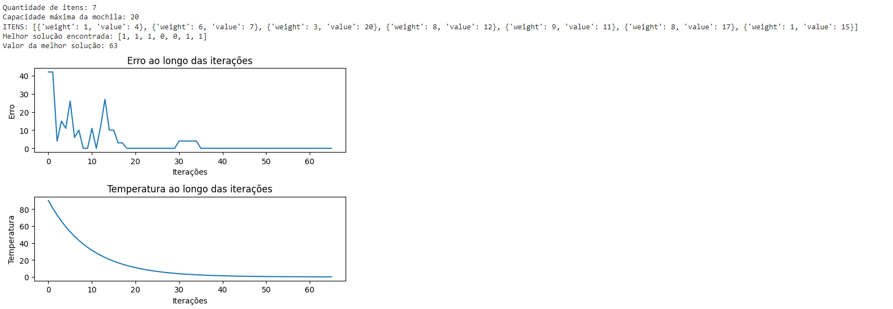
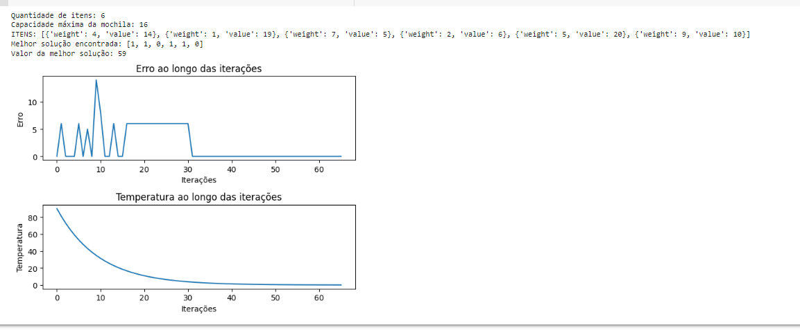
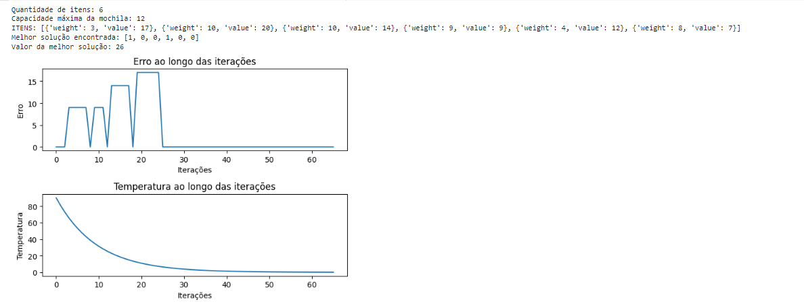
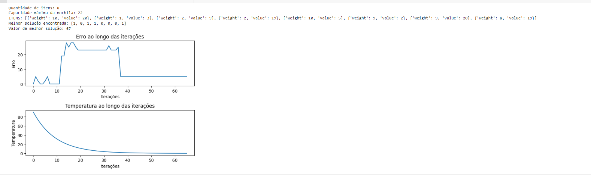

# O problema da Mochila
#### _Gustavo Alvarenga Marzoque - 201910392_
#### Professor: Eric Fernandes de Mello Araújo
#### Disciplina - Inteligência Artificial -Turma 14A - UFLA

 
## Introdução

 Esse código visa resolver ao "Problema da Mochila", um problema de otimização combinatória. Ele visa decidir quais os itens serão selecionados para se adicionar dentro da mochila considerando o seu valor e o seu peso, de forma que se tenha o maior valor possível sem que se exceda a capacidade de peso máxima permitida.

## Sobre o Código

#### Bibliotecas utilizadas:
- Random
- Math
- Matplotlib

#### Passo a passo

##### Definição dos parâmetros:
O código vai ser responsável por definir os parâmetros do problema, como o número de itens, que vai ser gerado de forma aleatória, além da capacidade de peso máxima que a mochila pode suportar, e os parâmetros que serão utilizados pelo Simulated Annealing: temperaturas inicial, final e a taxa de resfriamento.

##### Geração de itens aleatórios:
O código vai ficar responsável por gerar de forma aleatória os itens, e atribuindo também valor e peso aleatório pra cada um deles.

#### Função de avaliação
É a função capaz de fazer uma avaliação onde verifica qual é o valor total dos itens selecionados e também faz a verificação se o peso total não excede a capacidade máxima definida.

#### Inicialização
O código vai inicializar uma solução aleatória, armazenar qual que é a melhor solução encontrada até o momento e qual vai ser o seu valor.

#### Simulated Annealing 

O laço principal vai sendo executado enquanto a temperatura não atingir ao valor final. Toda vez que tem uma iteração nova, é gerada uma nova solução vizinha, calculando seu valor e a diferença de valor em relação à atual é checada. Se a solução nova for melhor que a antiga, ela passa a ser a solução atual. Do caso contrário, é feito o aceite da nova solução vizinha com uma probabilidade que depende da diferença de valor e da temperatura atual. Sendo que, quanto maior a temperatura, maior é a probabilidade de se aceitar soluções piores, isso faz com que o algoritmo possa escapar de mínimos locais.

#### Cálculo dos erros e das temperaturas:
Enquanto são realizadas as iterações, o erro(que é a diferença entre o valor da melhor e da atual solução) e a temperatura são calculados e armazenados em listas.

#### Resultados
No fim das operações algorítmicas, a melhor solução e o seu valor são exibidos na tela.

#### Gráficos

No final, são exibidos os gráficos. Para a sua construção, utilizei a biblioteca Matplotlib. Um gráfico é o que exibe o erro ao longo de todas as iterações realizadas pelo algoritmo, enquanto o outro exibe o comportamento da temperatura ao longo de todas as iterações. Com isso, é possível analisar a convergência do algoritmo e a redução da temperatura.

## Imagens dos Gráficos:

## Análise do resultado dos gráficos:

#### Gráfico de Erros

- O eixo X representa o número das iterações do algoritmo Simulated Annealing.
- o eixo Y representa qual a diferença entre o valor da melhor solução achada até no momento e qual o valor da solução atual por iteração.
- Se o gráfico apresenta uma tendência descrescente, é um indicativo que o algoritmo está se convergindo pra uma solução melhor à medida que são feitas novas iterações. Quanto menor erro, melhor é a solução.
- É esperado tambem que o erro vai diminuindo à medida que o algoritmo vai avançando e que, eventualmente chegue próximo de zero ou que se estabilize em um valor mínimo. Isso vai indicar que o algoritmo está com uma solução ótima ou muito próximo disso.
- Se o gráfico apresentar flutuações ou um padrão irregular, isso pode ser um indicativo que o algoritmo ficou preso em mínimos locais ou está explorando o espaço de uma maneira não ideal.

#### Gráfico da Temperatura

- O eixo X representa o número das iterações do algoritmo Simulated Annealing.
- O eixo y representa qual o valor de temperatura por iteração.
- A temperatura é considerada como um parâmetro crítico do algoritmo, pois, controla a probabilidade de se aceitar soluções piores à medida que o algoritmo vai avançando.
- O gráfico da temperatura deve ter uma tendência decrescente à medida que as iterações vão avançando. Isso vai ocorrer pois a temperatura vai sendo resfriado de forma gradual pra permitir que seja realizada uma exploração mais intensa do espaço.
- O resfriamento também tem como função de ajudar o algoritmo a escapar de mínimos locais, permitindo a aceitação ocasional de piores situações. Logo, é esperado que a temperatura diminua de forma lenta durante as iterações.
- Se a temperatura reduzir muito rápido, o algoritmo pode ficar preso em mínimos locais e não conseguir explorar melhores situações.

